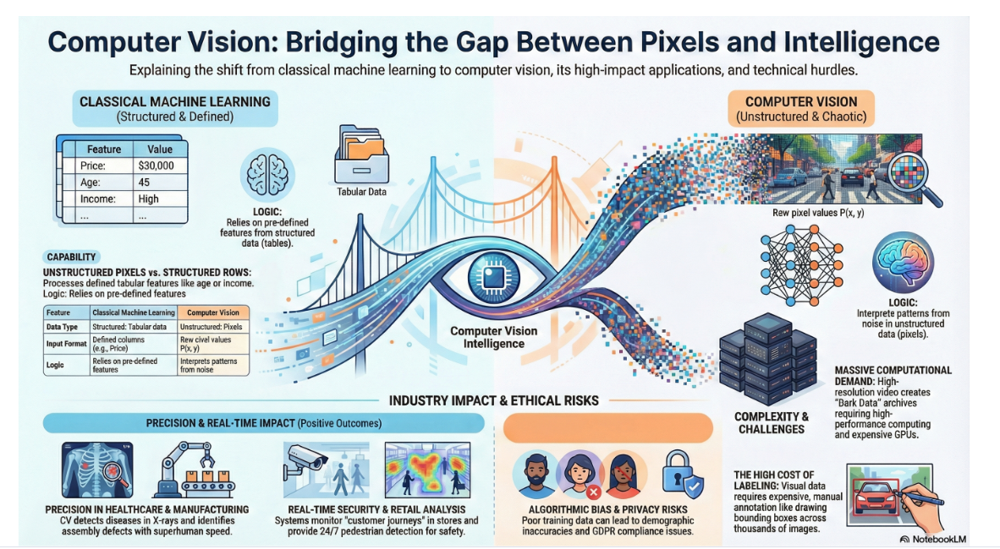

# Computer Vision: From Visual Perception to Automated Intelligence

## 1. Defining Computer Vision (CV)

Computer Vision is a specialized branch of **Artificial Intelligence (AI)** that empowers computational systems to interpret, understand, and derive actionable insights from visual inputs, specifically images and videos. Its primary objective is to replicate human-like visual perception to facilitate automated decision-making.

### CV vs. Classical Machine Learning (ML)
The distinction between CV and classical ML lies primarily in the nature of the data and the feature extraction process:

| Feature | Classical Machine Learning | Computer Vision |
| :--- | :--- | :--- |
| **Data Type** | Structured: Tabular data (rows and columns). | Unstructured: Pixels in images and videos. |
| **Input Format** | Defined features (e.g., Age, Income, Price). | Raw pixel values $P(x, y)$ in a grid. |
| **Logic** | Relies on pre-defined feature columns. | Must interpret patterns, shapes, and objects from noise. |

---

## 2. Technical Capabilities & Functional Applications

Computer Vision replaces manual human observation with high-speed, automated processing. The core functionalities include:

* **Automated Image Processing:** Replacing manual sorting and categorization tasks with algorithmic speed.
* **Object Recognition:** The ability to identify and precisely locate specific items within a visual stream (e.g., detecting pedestrians in a 24/7 video feed).
* **Image Classification:** Assigning a label to an entire image based on predefined categories (e.g., "Defective" vs. "Non-defective" in a manufacturing line).
* **Video Analysis:** Real-time monitoring of temporal data to identify specific actions, anomalies, or events as they occur.

---

## 3. Business Utility & Industry Use Cases

The prevalence of visual data in the digital economy makes CV a critical tool for organizations seeking to unlock value from **"dark data"** (unused visual archives).

### Sector-Specific Deep Dive:
* 🏥 **Healthcare:** Analysis of medical imaging (X-rays, MRIs) to detect diseases like cancer with higher speed and accuracy than traditional manual radiology.
* 🏭 **Manufacturing:** Quality control automation (e.g., Tesla using CV to inspect car parts for defects during assembly).
* 🛡️ **Security:** Utilizing facial recognition for identity verification and enhancing security screening at critical infrastructure like airports.
* 🌾 **Agriculture:** Deploying drones equipped with CV to monitor crop health, analyze soil conditions, and detect pest infestations autonomously.
* 🛒 **Retail:** Analyzing "customer journeys" through a store to optimize layout and marketing strategies.

---

## 4. Technical Challenges of Visual Data

Working with visual data is significantly more resource-intensive than working with tabular data due to several factors:

1.  **Data Volume:** High-resolution images and video streams result in massive file sizes, requiring significant storage and **High-Performance Computing (HPC)** for processing.
2.  **Complexity:** Features are not explicitly defined in "columns." Instead, the model must learn to recognize patterns and shapes within raw pixel matrices.
3.  **Variability:** Models must be robust against environmental noise, including lighting shifts, camera angles, varied backgrounds, and electronic noise.
4.  **Labeling Costs:** Unlike structured data, which often has inherent labels, visual data requires manual annotation (e.g., drawing bounding boxes or tagging thousands of images).

---

## 5. Potential Risks & Gaps in Information

### ⚠️ Potential Risks:
* **Algorithmic Bias:** In security and facial recognition, there is a risk of bias if the training data is not representative, leading to inaccuracies for specific demographics.
* **Hardware Dependencies:** The complexity of these models implies a heavy reliance on high-cost **GPUs (Graphics Processing Units)**, posing a budget risk for smaller organizations.
* **Privacy & Ethics:** Facial recognition and customer journey tracking raise significant data privacy and regulatory compliance (e.g., **GDPR**) risks.

### 🔍 Gaps in Information:
* **Model Architecture:** While the text mentions "training machines," it does not specify the architectures—such as **Convolutional Neural Networks (CNNs)**—that bridge the gap between pixels and decisions.
* **Technical Implementation:** The document promises comprehensive code and final models, but specific technical specifications (frameworks, versions) are currently absent.
* **Labeling Solutions:** While labeling is identified as a challenge, potential mitigations like **Active Learning** or **Synthetic Data** generation are not yet detailed.

# Technical Specifications: The Anatomy of a Pixel and Color Architectures

## 1. Technical Specifications: The Anatomy of a Pixel 🔬

In computer vision, an image is not merely a static picture but a coordinate-based grid of pixels. A pixel serves as the smallest unit of programmable color or intensity.

* **Grayscale Representation:** Operates as a 2D matrix ($Width \times Height$). Each pixel holds a single intensity value, typically ranging from $0$ (Black) to $255$ (White) in an 8-bit depth system.
[Image of grayscale image matrix mapping]
* **Resolution:** Defined by the total count of pixels ($Rows \times Columns$). High-resolution images (e.g., Full HD $1920 \times 1080$) contain over $2$ million individual data points, which significantly increases computational overhead.
* **Intensity Values:** These numerical values form the matrix or "table" that machine learning algorithms process, effectively translating visual light into distinct numerical signatures.
[Image of pixel grid representation in computer vision]

---

## 2. Color Space Architectures 🎨

The representation of color directly impacts how a model "sees" and interprets data. Different architectures are utilized based on the specific requirements of the computer vision task.

| Color Space | Structure | Primary Use Case |
| :--- | :--- | :--- |
| **RGB** | 3 Channels (Red, Green, Blue) | Standard digital perception; mimics the human eye. |
| **BGR** | 3 Channels (Blue, Green, Red) | Alternative ordering; commonly used in specific libraries such as OpenCV. |
| **HSV** | Hue, Saturation, Value | Object detection; isolates color (chromaticity) from lighting and brightness. |

[Image of RGB vs BGR vs HSV color space comparison]

---

## 3. Data Storage: Formats and Compression 💾

The choice of image format dictates the critical trade-off between data integrity and computational efficiency.

* **JPEG (Joint Photographic Experts Group):** Utilizes **lossy compression**. It reduces file size by discarding certain visual details, which may introduce unwanted artifacts during model training.
* **PNG (Portable Network Graphics):** Utilizes **lossless compression**. It preserves all original pixel data, resulting in larger file sizes but significantly higher precision.
[Image of JPEG vs PNG compression artifacts]
* **TIFF (Tagged Image File Format):** An uncompressed, high-quality format essential for precision-heavy fields such as medical imaging or satellite analysis.
* **EXIF Metadata:** Contains contextual data (GPS coordinates, timestamps, camera settings) that can provide secondary features for analysis beyond raw pixel values.
[Image of EXIF metadata structure]

---

## 4. Mathematical Multidimensionality 📐

For algorithmic processing, images are treated as **$N$-dimensional arrays**, commonly referred to as **Tensors**:

* **2D Arrays ($H, W$):** Utilized for grayscale images where only height and width are relevant to the intensity matrix.
* **3D Arrays ($H, W, C$):** Standard for color images, where $C$ represents the three distinct color channels.
* **Advanced Arrays ($H, W, C+N$):** May include additional channels such as Alpha (transparency) or Depth ($z$-axis information frequently found in medical or LIDAR data).

[Image of 3D tensor representation of an image]

---

## 5. Potential Risks & Gaps in Information ⚠️

### Potential Risks:
* **Computational Bottlenecks:** Processing HD images involves over $2$ million pixels per frame. Processing large batches requires high RAM and VRAM availability; failure to manage this via downsampling risks hardware failure or prohibitive training times.
* **Lossy Artifacts:** Relying on JPEG data for sensitive tasks (e.g., medical diagnosis) carries the risk of "compression artifacts" being misinterpreted by the model as actual physiological features or defects.
* **Channel Misordering:** A frequent technical risk is the confusion between RGB and BGR formats. If a model trained on RGB receives BGR data, its accuracy will plummet due to inverted color channels.

### Gaps in Information:
* **Normalization Techniques:** While pixel

# Technical Analysis: Functional Superiority of HSV Over RGB for Object Isolation

This technical analysis evaluates the functional superiority of the **HSV (Hue, Saturation, Value)** color space over the standard **RGB** model, specifically for the task of object isolation and color-based segmentation.

---

## 1. Structural Comparison of Color Models 🧪

To understand why HSV is preferred for isolation, we must analyze the mathematical distribution of data in both models.

### RGB (Red, Green, Blue)
In the RGB model, color and brightness are deeply intertwined across all three channels.
* **Data Distribution:** If the lighting of a scene changes, the values in the Red, Green, and Blue matrices all shift simultaneously.
* **Isolation Challenge:** To isolate a "red" object, a developer must define ranges for all three channels. Because "dark red" and "light red" have vastly different RGB triplets, creating a robust boundary is computationally complex.

### HSV (Hue, Saturation, Value)
HSV decouples visual information into three distinct, independent components:
* **Hue (H):** Represents the "color" itself (e.g., Red, Blue, Green). It is typically modeled as an angle ranging from $0^\circ$ to $360^\circ$.
* **Saturation (S):** Represents the "vibrancy" or purity of the color ($0\%$ is gray, $100\%$ is the pure color).
* **Value (V):** Represents the "brightness" or intensity of the light.

---

## 2. The Logic of Isolation: Why HSV Wins 🏆

The primary advantage of HSV is that it **separates chromaticity from brightness**. This leads to significant technical benefits in Computer Vision pipelines:

### A. Robustness to Lighting Variations
In real-world manufacturing or drone monitoring, lighting is rarely consistent.
* **In RGB:** A shadow falling on a green leaf changes the R, G, and B values, potentially moving the pixel out of the pre-defined "green" detection range.
* **In HSV:** A shadow primarily affects the **Value (V)** channel. The **Hue (H)** channel remains relatively constant, allowing the model to identify the "greenness" of the leaf regardless of illumination.

### B. Simplified Thresholding
Isolating an object by color (color segmentation) requires setting "thresholds" (minimum and maximum values).
* **RGB Complexity:** Requires a 3D bounding box in the color space: $(R_{min}, G_{min}, B_{min})$ to $(R_{max}, G_{max}, B_{max})$.
* **HSV Simplicity:** Isolation is often achieved by filtering a specific range on a single channel—the **Hue**.
    * *Example:* To find a yellow taxi, a developer targets the Hue range for "Yellow" (approx. $45^\circ$ to $75^\circ$) while ignoring fluctuations in brightness (**Value**) or wash-out (**Saturation**).

---

## 3. Technical Implementation Logic ⚙️

When a Computer Vision model processes these images, the workflow typically follows this logical progression:

1.  **Conversion:** The raw image (usually **BGR** in OpenCV or **RGB**) is mathematically converted to **HSV**.
2.  **Masking:** A binary "mask" is created where pixels within the target Hue range are set to $1$ (white) and all others to $0$ (black).
3.  **Refinement:** The **Saturation** channel is used to filter out noise (e.g., very pale colors that appear almost white).
4.  **Output:** The model identifies "blobs" of white in the mask as the isolated objects.

---

## 4. Potential Risks & Gaps in Information ⚠️

### Potential Risks
* **Wrap-around Discontinuity:** In many CV libraries (like OpenCV), the Hue channel is circular ($0$ and $180$ or $360$ both represent Red). This creates a **"split range"** risk where a model might fail if the target color sits at the very beginning and end of the numerical scale.
* **Computational Overhead:** The conversion from RGB to HSV is a mathematical transformation that adds a processing step, which could impact latency in ultra-high-speed real-time systems.
* **Hue Sensitivity in Low Light:** When the **Value (V)** is extremely low (near black), the **Hue (H)** becomes noisy and unreliable, leading to "false negatives" in dark environments.

### Gaps in Information
* **Specific Ranges:** The text does not provide specific numerical ranges for common colors in HSV (e.g., Red is typically $0-10$ and $160-180$ in OpenCV's 8-bit implementation).
* **Alternative Models:** While HSV is effective, other spaces like **CIELAB (Lab)**—which is even better at mimicking human vision and separating lightness—are not discussed.
* **Code Implementation:** Algorithmic functions for conversion (e.g., `cv2.cvtColor(img, cv2.COLOR_BGR2HSV)`) are deferred to future lessons.

---
# Master-Level Computer Vision: A Technical Deep Dive 👁️🤖

Bu doküman, **Master School** müfredatı kapsamında işlenen Bilgisayarlı Görü (Computer Vision - CV) konularının teknik bir incelemesidir. Geleneksel görüntü işleme tekniklerinden modern derin öğrenme mimarilerine kadar olan evrimi ve endüstriyel uygulama yöntemlerini kapsar.

---

## 1. Giriş ve Matematiksel Temeller

Bilgisayarlı Görü, yapılandırılmamış (unstructured) görsel verileri, makinelerin anlamlandırabileceği sayısal tensörlere dönüştürme sanatıdır.

### Dijital Görüntünün Temsili
Bilgisayarlar için bir görüntü, $H \times W \times C$ boyutlarında bir matristir:
* **Piksel ($P$):** Bir görüntünün en küçük birimidir. Genellikle 8-bit sistemlerde $0$ (siyah) ile $255$ (beyaz) arasında bir yoğunluk değeri taşır.
* **Koordinat Sistemi:** Bir pikselin değeri $P(x, y)$ fonksiyonu ile ifade edilir.
* **Renk Uzayları (Color Spaces):**
    * **GrayScale:** Tek kanallı ($C=1$) yoğunluk haritasıdır.
    * **RGB:** Üç kanallı ($C=3$) standart renk uzayıdır.
    * **BGR:** OpenCV kütüphanesinin standart kabul ettiği, kanalların (Mavi, Yeşil, Kırmızı) şeklinde sıralandığı formattır.

---

## 2. Klasik Görüntü İşleme (Classical CV)

Derin öğrenme öncesi dönemde kullanılan bu yöntemler, günümüzde hala "Ön İşleme" (Preprocessing) aşamasında kritik rol oynar.

### Temel Teknikler ve Metotlar
* **Görüntü Filtreleme (Kernels):** Bir çekirdek matrisin görüntü üzerinde kaydırılması ($convolution$) işlemidir.
* **Gaussian Blur:** Gürültü azaltma amacıyla kullanılır. Çevresel gürültünün (environmental noise) model üzerindeki etkisini minimize eder.
* **Kenar Algılama (Edge Detection):** Sobel ve Canny algoritmaları, görüntüdeki parlaklık gradyanlarını ($gradients$) hesaplayarak nesne sınırlarını belirler.
* **Morfolojik İşlemler:** **Erosion** (aşındırma) ve **Dilation** (genişletme) ile ikili görüntülerdeki gürültüler temizlenir.

---

## 3. Derin Öğrenme ve CNN Devrimi

Klasik yöntemlerin aksine, **Evrişimli Sinir Ağları (CNN)** özellikleri manuel olarak tanımlamak yerine veriden otomatik olarak öğrenir.

### CNN Katman Analizi
1. **Convolutional Layer (Evrişim Katmanı):** Filtreler aracılığıyla yerel özellikleri (kenar, doku, köşe) çıkarır.
2. **Activation (ReLU):** Doğrusallığı bozan $f(x) = \max(0, x)$ fonksiyonu ile ağın karmaşık desenleri öğrenmesini sağlar.
3. **Pooling Layer:** Genellikle **Max Pooling** kullanılır. Verinin boyutsallığını azaltarak hesaplama yükünü düşürür ve "kayma değişmezliği" (translation invariance) sağlar.
4. **Fully Connected Layer:** Öğrenilen öznitelikleri vektörel bir sınıfa dönüştürür.
5. **Softmax:** Çıkış katmanında olasılıksal bir dağılım oluşturur ($\sum P = 1$).

---

## 4. Karşılaştırmalı Analiz: Klasik vs. Derin Öğrenme

| Özellik | Klasik CV (OpenCV Tabanlı) | Derin Öğrenme (CNN/ViT) |
| :--- | :--- | :--- |
| **Özellik Çıkarımı** | Manuel (SIFT, HOG, Haar) | Otomatik (Self-learned) |
| **Veri İhtiyacı** | Düşük | Çok Yüksek (Big Data) |
| **Donanım** | CPU yeterli | GPU/TPU zorunlu |
| **Doğruluk** | Sınırlı ve hassas | Çok yüksek ve dayanıklı |
| **Açıklanabilirlik** | Yüksek (Matematiksel netlik) | Düşük (Black Box) |

---

## 5. Bilgisayarlı Görü Görevleri ve Modern Yaklaşımlar

### A. Görüntü Sınıflandırma (Classification)
Görüntünün tamamına bir etiket atar. 
* **Popüler Modeller:** ResNet (atlamalı bağlantılar), VGG16, MobileNet.

### B. Nesne Tespiti (Object Detection)
Nesnelerin yerini Sınırlayıcı Kutular (Bounding Boxes) ile belirler. 
* **YOLO (You Only Look Once):** Gerçek zamanlı analiz için endüstri standardıdır. Görüntüyü tek bir geçişte (single shot) işler.

### C. Segmentasyon (Segmentation)
Piksel düzeyinde maskeleme yapar.
* **U-Net:** Özellikle tıbbi görüntüleme ve otonom araçlarda nesne sınırlarını kesin olarak belirlemek için kullanılır.

---

## 6. Uygulama Alanları ve Gelecek

Bilgisayarlı görü, günümüzde şu alanlarda devrim yaratmaktadır:
* **Sağlık:** Radyolojik görüntülerde tümör tespiti.
* **Güvenlik:** Biyometrik doğrulama ve yüz tanıma.
* **Otonom Araçlar:** Çevresel farkındalık ve şerit takibi.
* **Tarım:** Dronlar ile ürün sağlığı analizi.

### Gelecek Trendi: Vision Transformers (ViT)
CNN'lerin yerini almaya başlayan ViT mimarileri, görüntüyü bir dizi (sequence) olarak ele alarak "Attention" mekanizması ile küresel bağlamı çok daha iyi kavrar.

---

## ⚖️ Etik ve Gizlilik
Yüz tanıma ve kitlesel izleme sistemlerinde **algoritmik önyargı** (algorithmic bias) ve **GDPR** uyumu en kritik konulardır. Veri setlerinin çeşitliliği, etik bir yapay zeka için zorunluluktur.

---
*Bu doküman Master School eğitimi notları ve sektörel iyi uygulama standartları ile oluşturulmuştur.*